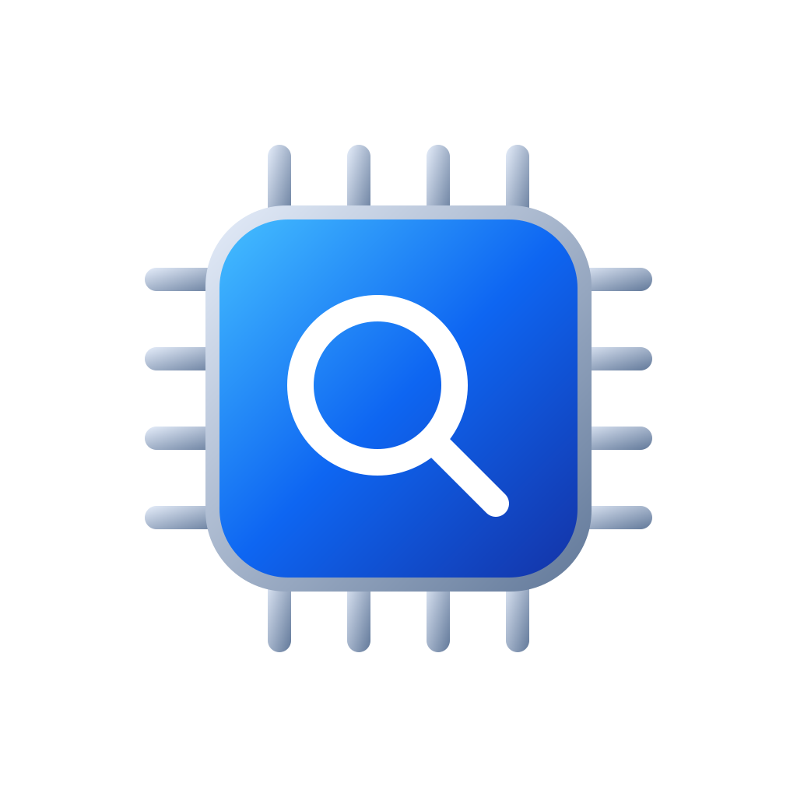

# Silicon Audit



**Which CPU security features does the kernel on *this* device actually expose?**

Silicon Audit is an open-source app and command-line tool for every Apple platform: iPhone, iPad, Mac,
Apple Watch, Apple TV, and Apple Vision Pro. It asks the kernel, through the public `sysctl` interface,
which security features it reports (memory tagging, pointer authentication, branch target protection,
speculation hardening, constant-time execution) and shows the answer next to what Apple *documents* for
that chip family, without ever mixing the two up.

Every fact carries its provenance:

| provenance | meaning |
|---|---|
| **measured** | this kernel reported it (`hw.optional.arm.FEAT_*`, `vm.mte.*`, …), or the app measured it about its own process |
| **documented** | Apple's published table for the chip family, with source and publication date |
| **inferred** | the app's own reasoning (kernel build target → chip family), with the reasoning spelled out |

"Measured" means *reported by this kernel*, not silicon truth: a kernel can mask a feature it has not
enabled. The [self-test](#enforcement-self-test) adds observations about this process; its fault test needs
a crash report to confirm the reason for termination.

## The app

One structure at two depths, so a non-specialist and an engineer read the same report:

- **Overview** is the home screen. A card names the chip, the device, and the OS build, and tallies how
  the checks came out; then each check answers a plain question with one word, one sentence, and where the
  answer came from: memory tagging hardware, Memory Integrity Enforcement, pointer authentication, branch
  target protection, speculation hardening, constant-time computing, the kernel protections Apple
  documents, and what the OS does for this app. Tapping a check lists the facts behind it.
- **Look deeper** (the end of the Overview on iPhone and Apple Watch; the sidebar on iPad, Mac, Apple TV
  and Vision Pro) opens *All readings*, every fact by category on three shelves with its state glyph,
  provenance, raw key, type, length, value, and plain-English meaning; *Apple's documentation*, the
  three-step chain from measured kernel target to inferred chip family to Apple's table column; *How this
  was measured*, the device identity, collection method, and totals; and *About the data*.

**Change monitoring.** The first reading on a device becomes a baseline. The app checks again when it
opens and periodically in the background, and records anything that moved: a protection that was reported
on and now reports off, a value that changed, a key that appeared or vanished, a system update. Changes
show as a card on the Overview and in a *Changes* screen, in plain words first ("Memory tagging hardware
was reported on and now reports off"), then what it could mean, then the technical before and after. A
local notification is opt-in. The monitor sees only what the kernel exposes; an attack like Operation
Triangulation, which bypassed kernel memory protection through undocumented chip registers, would not have
moved any reading, and the app says so. `silicon-audit diff a.json b.json` runs the same comparison.

Export is one primary action per platform: share sheet on iPhone, iPad and Vision Pro; Save panel on
Mac; "Send to iPhone" on Apple Watch; a QR code on Apple TV. The export is JSON with a published schema
(`Schema/export-v1.schema.json`) and contains no serial number, UDID, hostname, boot time, account, or
location. The app makes no network requests.

A persistent banner appears whenever the numbers describe the host rather than a real device:
Simulator, Rosetta translation, iOS app on a Mac, or a virtual machine.

## The command-line tool (macOS)

```bash
swift build -c release --product silicon-audit
.build/release/silicon-audit                      # human-readable audit with provenance glyphs
.build/release/silicon-audit export > report.json # full JSON export (schema 1.x)
.build/release/silicon-audit export --compact     # Base45 text for QR codes; `import` decodes it
.build/release/silicon-audit documented           # Apple's claims and the chain that gets there
.build/release/silicon-audit keys                 # every key the MIB walk found, annotated or not
.build/release/silicon-audit self-test --fault    # is this process's memory tagged, and checked?
```

`--fixture docs/evidence/Mac17,7-25G83.txt` runs the whole pipeline against a recorded `sysctl -a`
dump, so results from any device can be reproduced and tested without the device.

## Results database

`results/` holds contributed exports, one file per device and OS build, and CI generates
[MATRIX.md](MATRIX.md) and a static site from them: chip → feature → state, side by side. The schema
doubles as the privacy allowlist, exports from simulators, translated processes, iOS-on-Mac, or virtual
machines are rejected, and two submissions for the same device and build that disagree are shown as a
conflict, never silently resolved. See [results/README.md](results/README.md) to contribute yours.

## Enforcement self-test

A capability flag does not prove the OS turned enforcement on for a given process. The app measures two
things about *its own* process and labels them as such (they depend on how the build was signed, not on
the chip):

1. **Tagged pointers**: allocate heap blocks and read the tag bits. Present when the OS tags this
   process's memory.
2. **Tag-check fault** (CLI only): a child process of the same binary deliberately stores past a heap
   block. SIGKILL after its announcement is consistent with a tag-check fault; confirm
   `EXC_ARM_MTE_TAGCHECK_FAIL` in the crash report. Survival does not prove checks are disabled:
   adjacent allocations can share a tag. The graphical app runs only the safe pointer observation.

Both need Apple's Enhanced Security entitlements. The app has `DebugHardened`/`ReleaseHardened`
configurations; iOS, macOS, and visionOS release archives default to `ReleaseHardened` (pass
`--standard` after the platform to opt out). tvOS uses `Release` because Enhanced Security is not
supported there. `Scripts/sign-hardened.sh` re-signs the CLI. Measured on
an M5 Mac: hardened, 55 of 65 allocations tagged and the child killed with `EXC_ARM_MTE_TAGCHECK_FAIL`;
unsigned, nothing tagged and the store survives. Details in
[docs/evidence/self-test-Mac17,7-25G83.md](docs/evidence/self-test-Mac17,7-25G83.md).

## Building

Requirements: Xcode 26, [XcodeGen](https://github.com/yonaskolb/XcodeGen), and for the results tooling
Node 20+.

```bash
Scripts/gen-project.sh              # writes SiliconAudit.xcodeproj from project.yml (gitignored)
Scripts/test.sh                     # swift build + swift test (Swift Testing)
Scripts/gen-icons.sh                # regenerate app icons and the project logo
Scripts/run-simulator.sh tvOS       # build, install and launch on a simulator (iOS, tvOS, visionOS, watchOS)
Scripts/run-device.sh               # build, install and launch on the attached iPhone
Scripts/validate-export.sh out.json # validate an export against the schema (ajv)
```

Signing: copy `Configs/Signing.xcconfig.example` to `Configs/Signing.xcconfig` and set your team. A free
Personal Team is enough for every platform, including the Enhanced Security entitlements.

## Layout

| path | what |
|---|---|
| `SPEC.md` | the implementation spec (v0.2), the source of truth for behaviour and copy |
| `docs/spec-review.md` | every finding from the spec review and the nine implementation phases, with evidence |
| `docs/audit-2026-09-16.md` | codebase audit, fixes, regression checks, and remaining release qualification |
| `docs/brand/` | the new logo, light/dark artwork, and regeneration notes |
| `docs/evidence/` | recorded `sysctl` dumps and hardware measurements (M5 Mac, iPhone 17 Pro Max, Apple Watch Series 9) |
| `Sources/SiliconAuditCore` | the engine: probe, walk, inventory, identity, documented matrix, export, self-test |
| `Sources/SiliconAuditUI` | the shared SwiftUI views and models |
| `Sources/silicon-audit` | the CLI |
| `Sources/SiliconAuditCore/Resources` | the data files (known keys, capability bits, CPU families, SoC map, Apple's matrix), each with a `verified` date |
| `Apps/` | the app entry points and entitlements; `project.yml` describes the Xcode project |
| `Schema/` | the export JSON Schema (2020-12) |
| `Tools/` | data generators, the results-matrix generator, the icon generator |
| `results/`, `MATRIX.md`, `site/` | the community results database and what is generated from it |

## License

Apache-2.0. See [LICENSE](LICENSE).
