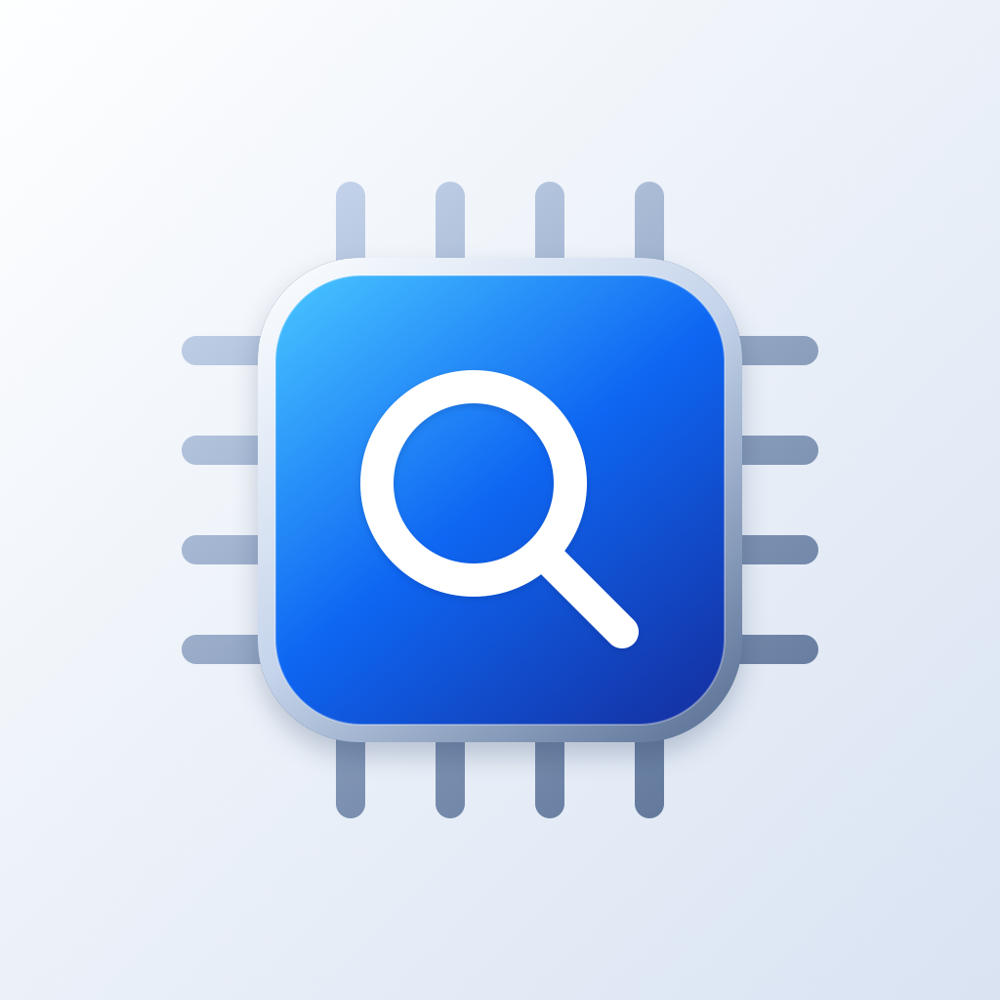

# Silicon Audit identity

The mark pairs a silicon die with an inspection lens. Blue glass, a restrained silver edge,
rounded contacts, and generous space make it recognizable at small sizes without suggesting
that the app certifies a device as secure. It contains no Apple logo, proprietary symbol,
font outlines, or external bitmap dependencies.

- `silicon-audit.svg`: scalable logo with a transparent background, for the README and results site.
- `icon-1024-light.png` and `icon-1024-dark.png`: opaque square artwork; iOS applies its own mask.
- `icon-1024-macos.png`: rounded macOS tile with a transparent outer margin.
- The asset catalog also contains all macOS resolutions, the Watch icon, and separate
  foreground/background layers for tvOS and visionOS, plus the TV top-shelf artwork.

Run `Scripts/gen-icons.sh` from any directory to regenerate and install every asset. The source
is `Tools/gen-icons/gen-icons.swift`; CoreGraphics draws the artwork directly at each resolution.
The macOS 16/32-pixel versions use a slightly heavier lens stroke. The installer follows the
asset catalog manifests, so a missing generated asset fails instead of leaving an older icon.

The design uses the simple silhouette, consistent identity, and platform-specific backgrounds
and layers described in [Apple's app-icon guidance](https://developer.apple.com/design/human-interface-guidelines/app-icons).
These are asset-catalog icons compatible with the project's older deployment targets. They are
not an Icon Composer `.icon` bundle and do not claim custom dynamic Liquid Glass rendering.
